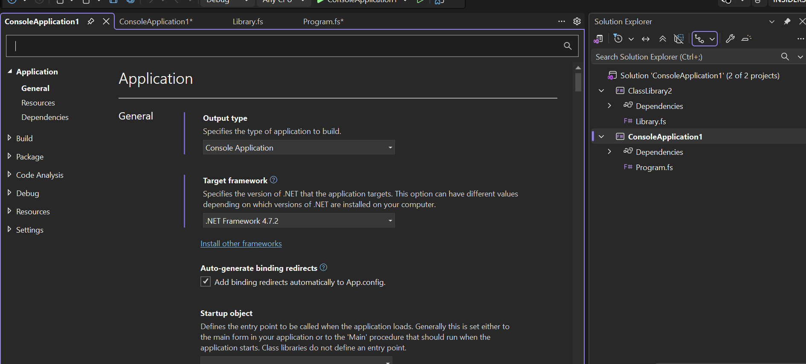
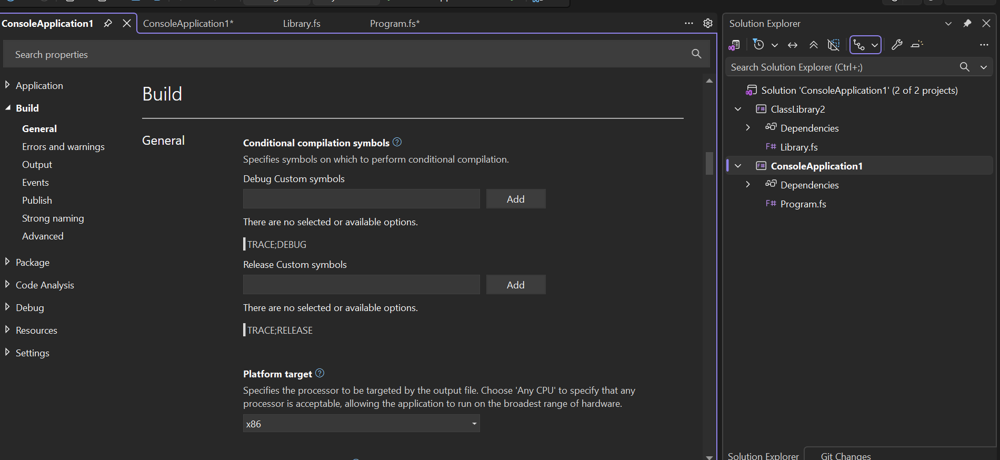

# Verify multi-project build

## Prerequisite

Ensure that **F# desktop language support** is installed for Visual Studio through Visual Studio Installer.

## Test steps

1. Create an **F# Console Application (.NET Framework)** project.

   1. Click **Create a new project**.
   2. Set the language filter to **F#**.
   3. Select **Console Application (.NET Framework)** and click **Next**.
   4. Set **Project name** to `FSharpConsole`.
   5. Keep the other project settings unchanged.
   6. Select **.NET Framework 4.7.2** and click **Create**.

2. Add an **F# Class Library (.NET Standard 2.0)** project to the solution.

   1. After the console project finishes loading, select **File > Add > New Project...**.
   2. Select the F# **Class Library** template and click **Next**.
   3. Set **Project name** to `FSharpLibrary`.
   4. Click **Next**.
   5. Select **.NET Standard 2.0** and click **Create**.

3. Add the class library as a dependency of the console application.

   1. Select **View > Solution Explorer**.
   2. Right-click the `FSharpConsole` project and select **Add > Project Reference...**.
   3. In **Reference Manager**, select **Projects > Solution**.
   4. Select `FSharpLibrary` and click **OK**.

4. Open `Program.fs` in the `FSharpConsole` project.

5. Add a new line as the first statement in the `main` function and type `fsharpl`.

```fsharp
// Learn more about F# at http://docs.microsoft.com/dotnet/fsharp
// See the 'F# Tutorial' project for more help.

// Define a function to construct a message to print
let from whom =
    sprintf "from %s" whom

[<EntryPoint>]
let main argv =
    fsharpl
    let message = from "F#" // Call the function
    printfn "Hello world %s" message
    0 // Return an integer exit code
```

6. Verify that IntelliSense proposes the `FSharpLibrary` namespace.

7. Complete the new line:

```fsharp
FSharpLibrary.Say.hello "Kevin"
```

8. Select **Build > Rebuild Solution**.

9. Verify in the **Output** window that the rebuild succeeds.

10. Set a breakpoint on the following line:

```fsharp
0 // Return an integer exit code
```

11. Press **F5** to start debugging.

12. Verify that execution reaches the breakpoint successfully.

13. Verify that the console output contains:

```text
Hello Kevin
Hello world from F#
```

14. Select **Debug > Stop Debugging**.

15. In **Solution Explorer**, right-click the `FSharpConsole` project and select **Properties**.

16. Verify that the **Application** page shows **Console Application** as the output type and **.NET Framework 4.7.2** as the target framework.



17. Select the **Build** tab and verify that the build settings are displayed.


